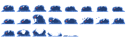
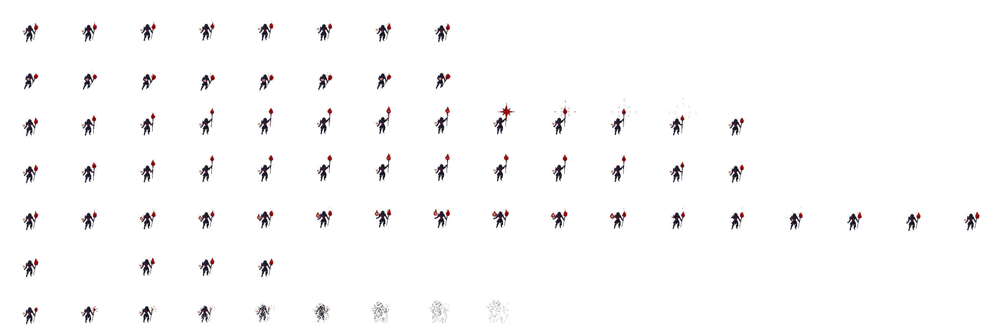

# RPG Game - 2D 像素风角色扮演游戏

一款采用像素美术风格的 2D 奇幻角色扮演游戏，场景为哥特式城堡与月夜氛围，包含角色成长、技能树与锻造等经典 RPG 玩法。

## 项目简介

本作品为跟随教程学习的 Unity 2D RPG 项目，在暗色奇幻世界观下，玩家可操控骑士/战士角色进行探索、战斗与养成。游戏具备完整的角色界面、技能树与锻造系统。

## 游戏特色

- **像素美术风格**：复古像素画面，深蓝/灰黑色调搭配暖色灯光与明月，营造神秘氛围
- **角色与战斗**：骑士/战士造型，支持多种武器与技能（剑、爪、冰系魔法等），血条与快捷栏完整
- **技能树系统**：多分支技能树，节点通过绿色连线展示成长路径，涵盖移动、魔法、近战、防御等方向
- **锻造系统**：可打造装备（如「蓝狼护甲」），查看属性加成（力量、生命、护甲、魔抗等），消耗材料进行合成
- **界面结构**：统一顶部导航——角色（Character）、技能树（Skill tree）、锻造（Craft）、选项（Options）

## 敌人类型

游戏中的敌人素材位于 `Graphics/Enemies/`，包含以下类型：

### 史莱姆 (Slime)

蓝色胶状生物，红眼，半透明质感。动画：待机、攻击（露出尖牙）、死亡溶解。

### 骷髅 (Skeleton)

骷髅战士，持长柄斧，骨色躯干。动画：待机、行走、攻击、受击、反应、死亡。

### 红帽 (Red Hood)

深红盔甲人形，戴兜帽，持剑/匕首。多向移动、挥砍攻击、白/红轮廓特殊状态。

### 暗夜之子 (Night born)

紫光幽影生物，虫形或人形变体。待机、奔跑、攻击、受伤、死亡；紫色能量斩击与爆炸。

### 死亡使者 (Bringer of Death)

黑袍死神，持镰刀，紫色幽光。待机、行走、镰刀挥击释放暗影冲击波、受伤消散、死亡。

### 死灵法师 (Necro)

黑袍兜帽，手持红色法球。待机、移动、发射红色星形魔法弹、受击闪烁、死亡化为黑烟。

## 操作说明

| 按键/操作 | 功能 |
|----------|------|
| Q | 格挡 |
| L.Shift | 冲刺技能/学习分身后冲刺可以召唤 |
| F | 水晶球 |
| R.Mouse | 投掷剑 |
| 数字1 | 使用红药水 |
| R | 黑洞技能 |

## 截图预览

### 主场景 — 城堡月夜

角色立于石台，血条与快捷栏可见，远处城堡与满月构成主场景。

### 锻造界面

锻造页签下的装备预览、属性与材料槽、CRAFT 按钮。

### 技能树界面

  
技能树页签下的分支节点与图标（移动、魔法、战斗等）。

## 技术说明

- **引擎**：Unity（项目包含导出后的运行数据与 Mono 运行环境）
- **类型**：2D 像素风 RPG / 平台冒险

## 学习资源

本项目学习自以下教程：

- **Bilibili 教程**：[https://www.bilibili.com/video/BV1Zs3gzKEDP/](https://www.bilibili.com/video/BV1Zs3gzKEDP/)

## 许可证

请以原教程与素材的授权为准，本项目仅供学习交流使用。
